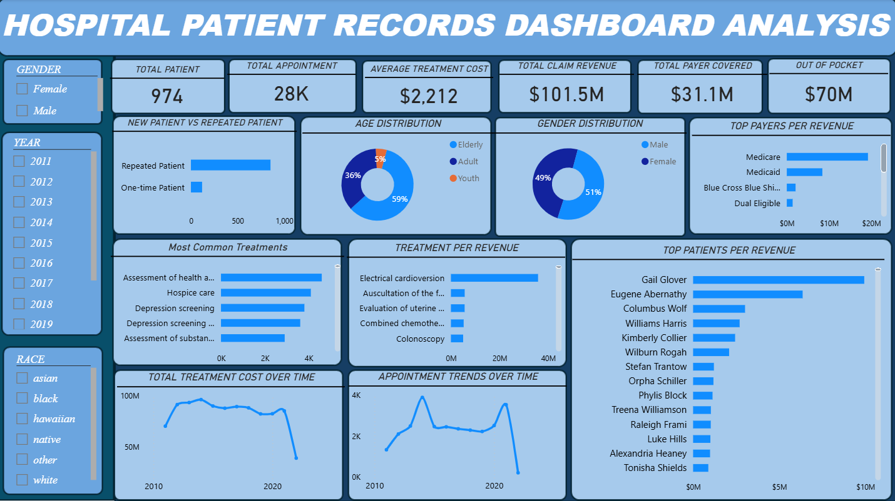

# Healthcare Patient Records Analysis 

## Project Overview 
This project analyzes healthcare data to understand patient demographics, encounters, healthcare costs, and key performance indicators.

The analysis combines SQL for data querying and transformation with Power BI for interactive visualization and dashboard reporting.

## Tools Used
SQL Server Management Studio (SSMS)
SQL
Power BI
Excel
Data Visualization

## Business Objectives

The analysis focuses on understanding:
Patient trends and demographics
Encounter patterns over time
Healthcare costs
Treatment and encounter metrics
Key performance indicators (KPIs)

## Project Workflow
Data preparation and cleaning
SQL data analysis
KPI calculation
Data validation
Data model
Power BI visualization
Dashboard development

## Insights and recommendations

## Dashboard

### Healthcare Patient Records Analysis Dashboard

## Project Files

SQL/healthcare_analysis.sql — SQL queries used for the analysis
PowerBI/healthcare_dashboard.pbix — Power BI dashboard
images/healthcare_dashboard.jpg — Dashboard preview

## Key Insights

The analysis provides insights into patient activity, encounter trends, and healthcare costs that can support better monitoring and data-driven decision-making.

## Recommendations

The findings can be used to monitor healthcare KPIs, identify changes in patient activity, track costs, and support operational planning.

## Author 
Adejumo Damilola 

Data Analyst | SQL | Power BI | Python | Excel

